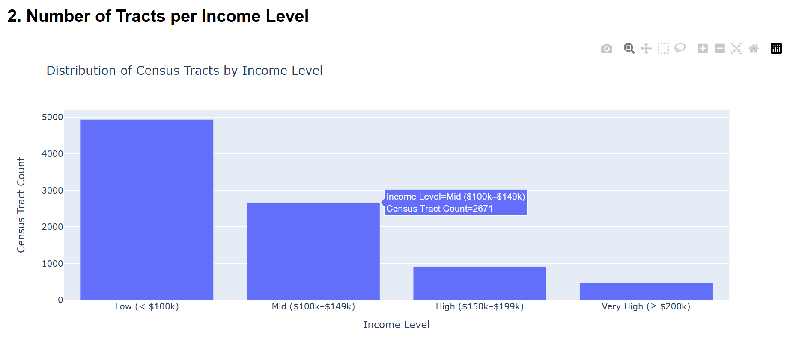

# 🗺 Alameda County Income Dashboard

A web-based interactive dashboard built with **Flask** and **Plotly** that visualizes median income distribution across census tracts in Alameda County, California. The project integrates spatial data transformations using **DBT**, file storage via **MinIO**, and geospatial visualizations using **Plotly Express** and **Mapbox**.

## 🚀 Features

- 📊 **Tract Count by Income Level**  
  A bar chart showing how many census tracts fall under each income category.
  

- 📈 **Income Distribution by Level**  
  A box plot comparing the spread of median income across different income levels.
  

- 📁 **Automated Spatial Processing Pipeline**
  - Raw GeoJSON files are uploaded to MinIO (`raw` bucket).
  - Spatial transformations are performed using DBT and SQL (e.g., geometry cleaning, enrichment).
  - Transformed data is exported as JSON to MinIO’s `processed` bucket.
  - The Flask dashboard reads the processed data and renders interactive charts.

---

## 🧱 Tech Stack

| Layer         | Tools & Technologies                 |
| ------------- | ------------------------------------ |
| Backend       | Flask, Python                        |
| Visualization | Plotly Express, Mapbox               |
| Data Pipeline | DBT, PostgreSQL with PostGIS         |
| Automation    | n8n (workflow orchestration)         |
| Storage       | MinIO (S3-compatible object storage) |

---

## 📂 Project Structure

```
📁 data/
  └── alameda_income_processed.json   # Processed dataset from DBT
📁 templates/
  └── dashboard.html                  # HTML template rendered by Flask
📄 app.py                             # Main Flask application
```

---

## 📈 Income Level Classification

| Income Level | Range         |
| ------------ | ------------- |
| Very High    | ≥ $200,000    |
| High         | $150k – $199k |
| Mid          | $100k – $149k |
| Low          | < $100k       |

---

## ▶️ How to Run

### 1. Clone the Repository

```bash
git clone https://github.com/your-username/alameda-income-dashboard.git
cd alameda-income-dashboard
```

### 2. Install Dependencies

```bash
pip install -r requirements.txt
```

> Required packages: Flask, Plotly, pandas, shapely

### 3. Add Processed Data

Place your processed file in the `data/` directory as:

```
data/alameda_income_processed.json
```

> This file can be downloaded from MinIO’s `processed` bucket after running the DBT pipeline.

### 4. Launch the App

```bash
python app.py
```

Visit the dashboard at:  
👉 [http://127.0.0.1:5000](http://127.0.0.1:5000)

---

## 🌐 Dashboard Previews

1. **Map** – Tract-level income visualization
2. **Bar Chart** – Tract count by income level
3. **Box Plot** – Median income spread by level

---

## 🧗 Challenges & Solutions

### ⚠️ Challenge 1: Slow Insert Performance in PostgreSQL via n8n

- **Problem**: The `Insert Raw` feature in n8n’s PostgreSQL node was too slow for large GeoJSON datasets.
- **Solution**: Used a **custom Code node** to generate a single bulk SQL `INSERT` query with all rows.

```javascript
const tableName = "juho_test.alameda_income_raw";
const fields = ["geo_id", "tract_geoid", "name", "median_income", "geom"];

const values = items.map((item) => {
  const geo_id = item.json.geo_id
    ? `'${item.json.geo_id.replace(/'/g, "''")}'`
    : "NULL";
  const tract_geoid = item.json.tract_geoid
    ? `'${item.json.tract_geoid.replace(/'/g, "''")}'`
    : "NULL";
  const name = item.json.name
    ? `'${item.json.name.replace(/'/g, "''")}'`
    : "NULL";
  const income =
    item.json.median_income && !isNaN(item.json.median_income)
      ? Number(item.json.median_income)
      : "NULL";
  const geom = item.json.geom
    ? JSON.stringify(JSON.parse(item.json.geom))
    : "NULL";

  return `(${geo_id}, ${tract_geoid}, ${name}, ${income}, ST_SetSRID(ST_GeomFromGeoJSON('${geom}'), 4326))`;
});

const sql = `
  INSERT INTO ${tableName} (${fields.join(", ")})
  VALUES
  ${values.join(",\n")};
`;

return [{ json: { query: sql } }];
```

---

### ⚠️ Challenge 2: Broken JSON due to NaN / Infinity

- **Problem**: The `Convert to JSON` node in n8n failed to handle GeoJSON with values like `NaN` or `Infinity`.
- **Solution**: Used a **Code node** to manually clean and parse the file before feeding it downstream.

```javascript
const data = items[0].binary.data;
const jsonString = Buffer.from(data.data, "base64").toString("utf-8");

const cleaned = jsonString
  .replace(/: ?NaN/g, ": null")
  .replace(/: ?Infinity/g, ": null")
  .replace(/: ?-Infinity/g, ": null");

const parsed = JSON.parse(cleaned);

// Return each feature as a separate item
return parsed.features.map((feature) => {
  return { json: feature };
});
```

---

### ⚠️ Challenge 3: Plotly not Rendering in Shakudo

- **Problem**: Plotly charts wouldn’t render properly inside Shakudo's iframe-based environment.
- **Solution**: Switched to a full **Flask backend**, rendering Plotly charts to HTML and serving them directly.

---

### ⚠️ Challenge 4: CSV Format Limitations for Geospatial Data

- **Problem**: CSV format couldn’t handle nested geometry data cleanly.
- **Solution**: Switched the entire pipeline to use **GeoJSON** from ingestion to processing and visualization.

---

## 🛠️ Future Improvements

- Add a polygon-based choropleth map layer
- Add filtering (dropdowns, sliders) to explore income ranges
- Load GeoJSON files directly from MinIO using `boto3` or `minio-py`
- Schedule automatic pipeline runs via n8n

---

## 👨‍💻 Author

**Juho Choi**

---

## 📜 License

MIT License
